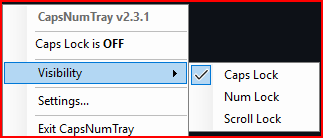
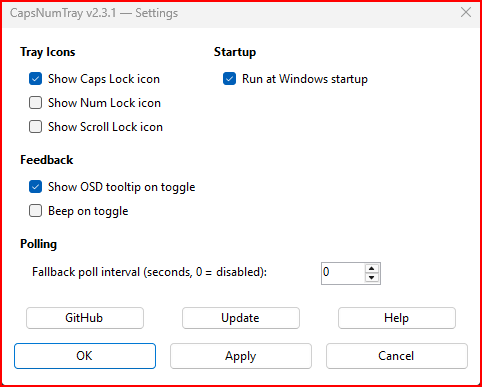

# CapsNumTray

Caps Lock, Num Lock, and Scroll Lock tray indicators for Windows.

A lightweight system tray utility that shows the current state of your lock keys as independent tray icons. Left-click to toggle, right-click for options. Bright icon = ON, dim icon = OFF.

## Features

- **Independent tray icons** for Caps Lock, Num Lock, and Scroll Lock
- **Left-click to toggle** any lock key from the tray
- **Light theme support**: Automatic dim icon variants for light taskbar themes
- **DPI-aware icons**: Crisp at any display scaling
- **Show/hide individual icons**: Scroll Lock hidden by default (opt-in)
- **On-screen display**: Floating tooltip shows state after toggle
- **Beep feedback**: Optional audible tone (higher pitch = ON)
- **Run at startup**: One-click toggle via Settings
- **Explorer restart recovery**: Icons survive Explorer crashes
- **Settings dialog**: GUI for all options with OK/Apply/Cancel

## Screenshots

| Tray Menu | Settings |
|:---:|:---:|
|  |  |

## Requirements

- Windows 10/11

## Installation

### Option 1: Download

Grab **[CapsNumTray.exe](https://github.com/itsnateai/CaplockNumlock/releases/latest)** from the latest release — single file, self-contained, no .NET runtime needed.

### Option 2: Build from source

```bash
git clone https://github.com/itsnateai/CaplockNumlock.git
cd CaplockNumlock

# Framework-dependent (~155KB, requires .NET 8 runtime)
dotnet publish -c Release

# Self-contained (~150MB, no runtime needed)
dotnet publish -c Release --self-contained true -p:PublishSingleFile=true -r win-x64
```

## Customization

Settings are stored in `CapsNumTray.ini` (auto-created next to the exe):

```ini
[Visibility]
ShowCaps=1
ShowNum=1
ShowScroll=0

[General]
ShowOSD=1
BeepOnToggle=0
```

| Key | Default | Description |
|-----|---------|-------------|
| `ShowCaps` | `1` | Show Caps Lock tray icon |
| `ShowNum` | `1` | Show Num Lock tray icon |
| `ShowScroll` | `0` | Show Scroll Lock tray icon |
| `ShowOSD` | `1` | Floating tooltip on toggle |
| `BeepOnToggle` | `0` | Audible tone on toggle |

## How It Works

CapsNumTray uses the Win32 `Shell_NotifyIconW` API directly (not `NotifyIcon`) to support multiple independent tray icons. A 250ms polling timer via `GetKeyState` keeps icons in sync even when keys are toggled externally. Icons are DPI-aware via `GetDpiForWindow` and automatically re-added if Explorer restarts.

## Project Structure

| Path | Description |
|------|-------------|
| `CapsNumTray.csproj` | .NET 8 project file |
| `Program.cs` | Entry point — single-instance enforcement |
| `TrayApplication.cs` | Core app — Shell_NotifyIconW, WndProc, key toggling, menus |
| `IconManager.cs` | DPI-aware icon loading with 3-stage fallback |
| `ConfigManager.cs` | INI file reader/writer |
| `OsdForm.cs` | Auto-hiding tooltip overlay |
| `SettingsForm.cs` | Settings GUI |
| `HelpForm.cs` | Help text window |
| `NativeMethods.cs` | Win32 P/Invoke declarations |
| `StartupManager.cs` | Startup shortcut management |
| `icons/*.ico` | 9 icon files (ON/OFF/Light variants) |
| `legacy/CapsNumTray.ahk` | Original AutoHotkey v2 script (archived) |

## License

[MIT](LICENSE)
